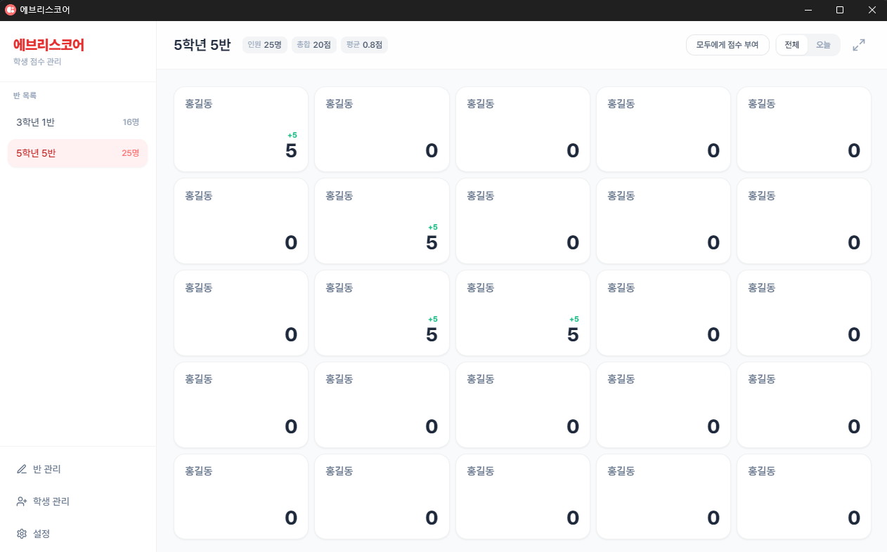

<p align="center">
  <picture>
    <source media="(prefers-color-scheme: dark)" srcset="image/banner_dark.png" />
    <source media="(prefers-color-scheme: light)" srcset="image/banner_white.png" />
    
  </picture>
</p>

<p align="center">교실에서 사용하는 학생 점수 관리 데스크톱 앱입니다.<br>
교사가 자신의 PC에 설치하여 로컬에서 사용하며, 모든 데이터는 로컬에 저장됩니다.</p>

## 주요 기능

- **반/학생 관리** — 반 추가·삭제·편집, 학생 추가·삭제·편집
- **점수 부여** — 학생 개별 또는 다중 선택·전체 일괄 점수 부여/차감, 사유 입력(선택)
- **점수 히스토리** — 날짜별 점수 기록 조회, 수정, 삭제
- **오늘/전체 보기** — 오늘 받은 점수만 보기 / 전체 누적 점수 보기 전환
- **전체화면 모드** — TV 화면 송출용, ESC로 해제
- **반응형 카드** — 창 크기·전체화면에 따라 카드와 글자 크기 자동 조절

<p align="center">
  
</p>

## 설치 및 실행

### 개발 모드

```bash
git clone https://github.com/your-username/everyscore.git
cd everyscore
npm install
npm run dev
```

### 빌드 (설치 파일 생성)

```bash
npm run build
```

`release/` 폴더에 `EveryScore Setup x.x.x.exe`가 생성됩니다.

## 데이터 저장 경로

```
Windows: %APPDATA%/everyscore/everyscore-data.json
```

## 라이선스

이 프로젝트는 MIT 라이센스 하에 배포됩니다. 자세한 내용은 LICENSE 파일을 참조하세요.